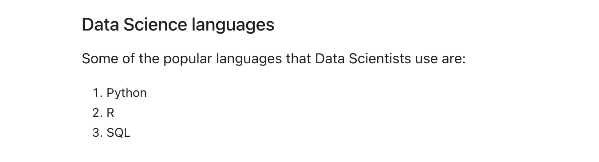
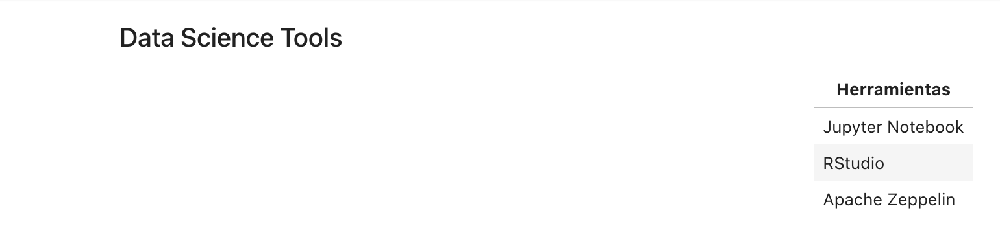
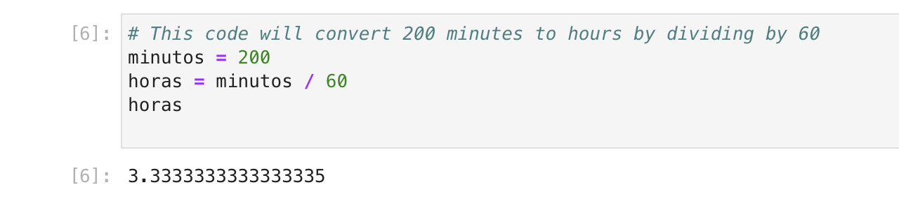
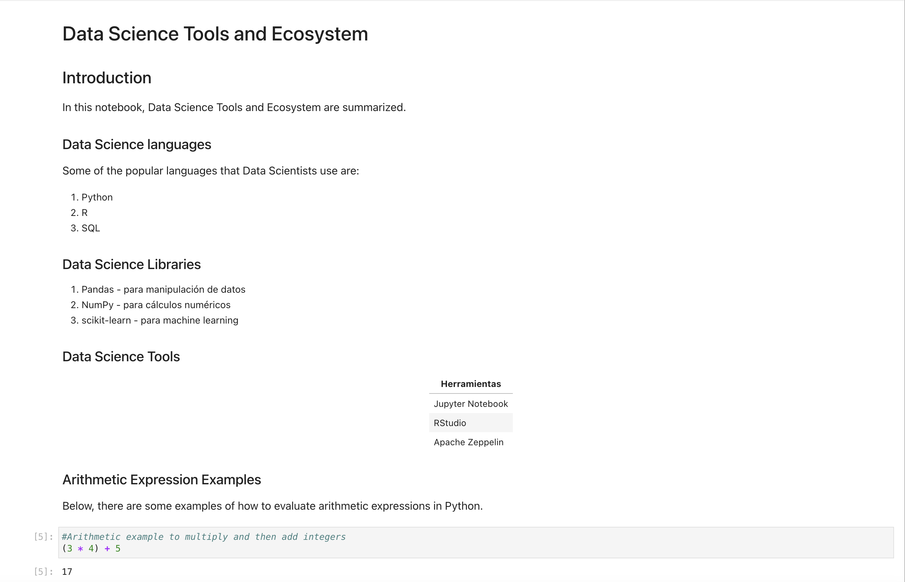

# Data Science Tools and Ecosystem Notebook

## Overview

This repository contains the `DataScienceEcosystem.ipynb` notebook, which serves as the capstone project for the data science course. The notebook demonstrates the application of various data science tools and methodologies introduced throughout the course.

## Exercises

Each exercise in the notebook is aimed at showcasing a particular aspect of the data science workflow:

### Exercise 2 - Notebook Title
A markdown cell with the title of the notebook using H1 style heading.

### Exercise 3 - Introduction
An introductory markdown cell describing the purpose of the notebook.

### Exercise 4 - Data Science Languages
A markdown cell listing popular data science languages.

### Exercise 5 - Data Science Libraries
A markdown cell detailing commonly used data science libraries.

### Exercise 6 - Data Science Tools Table
A markdown cell with a table presenting key data science tools.

### Exercise 7 - Arithmetic Expression Examples
An introduction to arithmetic expressions in Python with markdown.

### Exercise 8 - Arithmetic Code Execution
A code cell where a simple arithmetic expression is evaluated.

### Exercise 9 - Time Conversion Code
A code cell that converts minutes to hours.

### Exercise 10 - Objectives List
A markdown cell listing the objectives covered by the notebook.

### Exercise 11 - Author Information
A markdown cell indicating the author's name.

### Exercise 12 - GitHub Sharing
The notebook is shared through a public GitHub repository.

### Exercise 13 - Notebook Screenshot
A screenshot of the first page of the notebook.

## Usage

To view the notebook, you can visit the following GitHub link: [DataScienceEcosystem.ipynb](https://github.com/christopherwilliamflores/DataScience-Ecosystem-Jupyter-Notebook/blob/main/DataScienceEcosystem.ipynb).

For an interactive experience, you can clone the repository and run the notebook in your local Jupyter environment.

## Author

This project was completed by [Christopher William Flores Rimac]((https://github.com/christopherwilliamflores)).

## Acknowledgments

Special thanks to the instructors and peers who provided feedback and support throughout the course.
